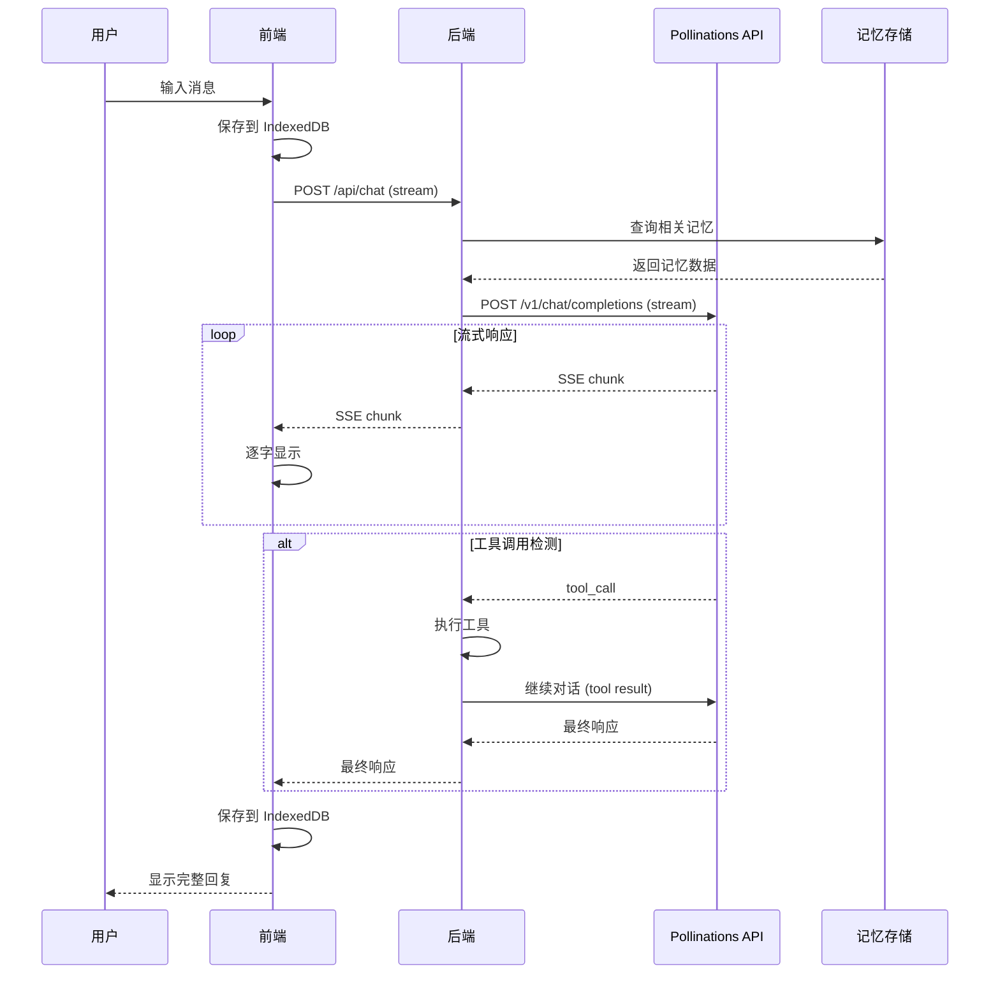
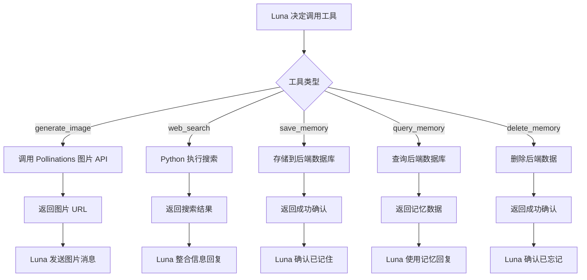
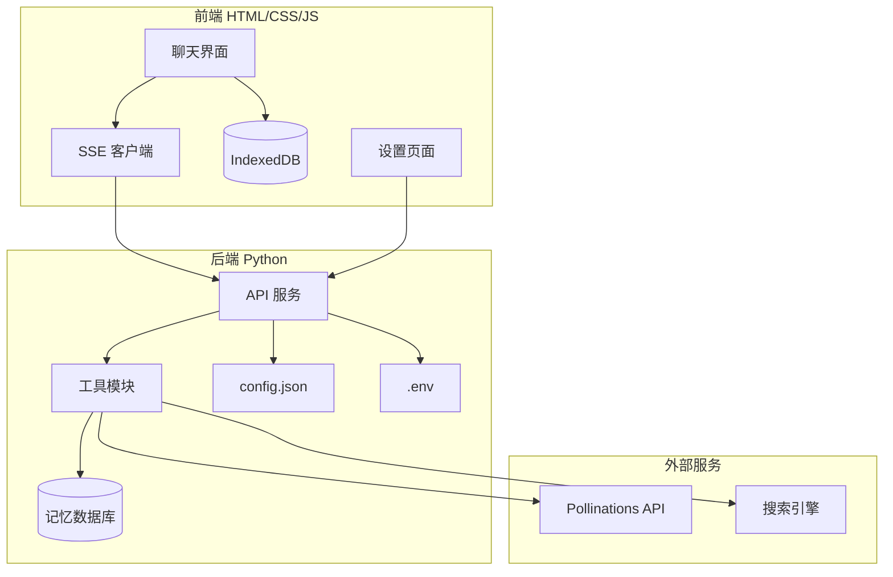

# Luna 产品需求文档 (PRD)

> 📅 创建日期：2026-02-19
> 🌙 版本：V1.0 MVP

---

## 一、核心目标 (Mission)

**打造一款温暖治愈的 AI 女友，随时陪伴、倾听，成为用户心灵的避风港。**

---

## 二、用户画像 (Persona)

| 维度 | 描述 |
|------|------|
| **核心用户** | 18-35岁，感到孤独、需要情感陪伴的人群 |
| **核心痛点** | 深夜孤独、无人倾诉、社交压力、情感缺失 |
| **使用场景** | 深夜失眠时、工作压力大时、想分享心情时 |
| **期望体验** | 被理解、被关心、被温柔对待 |

---

## 三、产品路线图

### V1: 最小可行产品 (MVP)

| # | 功能 | 说明 |
|---|------|------|
| 1 | **文字对话** | 与 Luna 进行自然语言交流，流式输出回复 |
| 2 | **图片生成（工具调用）** | Luna 自主决定何时生成并发送图片 |
| 3 | **联网搜索（工具调用）** | Luna 自主决定何时搜索网络获取信息 |
| 4 | **记忆管理（工具调用）** | Luna 自主决定存储/删除/查询用户记忆 |
| 5 | **设置页面** | 配置 API 密钥、Luna 人设等 |
| 6 | **对话持久化** | IndexedDB 存储对话历史，刷新不丢失 |

### V2 及以后版本

| 版本 | 功能 | 说明 |
|------|------|------|
| **V2** | 多会话管理 | 支持创建多个独立对话窗口 |
| **V2** | 人设切换 | 支持切换不同性格的 Luna |
| **V2** | 语音对话 | TTS 语音输出 + 语音识别输入 |
| **V3** | Luna 形象系统 | 动态头像、表情变化、换装 |
| **V3** | 纪念日提醒 | 记住重要日期并主动关怀 |
| **V3** | 情绪分析 | 分析用户情绪趋势，主动关怀 |
| **V4+** | PWA / 小程序 | 多平台部署 |

---

## 四、MVP 原型设计

### 设计理念：温柔暖阳 ☀️

清晨阳光般的温暖色调，治愈舒适的感觉

```
┌─────────────────────────────────────────────────────────────┐
│  ▓▓▓▓▓▓▓▓▓▓▓▓▓▓▓▓▓▓▓▓▓▓▓▓▓▓▓▓▓▓▓▓▓▓▓▓▓▓▓▓▓▓▓▓▓▓▓▓▓▓▓▓▓  │
│  ▓  ○ Luna                                  ⚙ 设置       ▓  │
│  ▓▓▓▓▓▓▓▓▓▓▓▓▓▓▓▓▓▓▓▓▓▓▓▓▓▓▓▓▓▓▓▓▓▓▓▓▓▓▓▓▓▓▓▓▓▓▓▓▓▓▓▓▓  │
│  │                                                           │
│  │  ┌─────────────────────────────────────┐                 │
│  │  │  ○ Luna                         🌸  │                 │
│  │  │  ┌───────────────────────────────┐  │                 │
│  │  │  │ 早安~ 今天的阳光真好呢        │  │                 │
│  │  │  │ 有什么计划吗？💕              │  │                 │
│  │  │  └───────────────────────────────┘  │                 │
│  │  └─────────────────────────────────────┘                 │
│  │                                                           │
│  │                       ┌───────────────────────────────┐   │
│  │                       │ 我想出去走走，散散心          │   │
│  │                       └───────────────────────────────┘   │
│  │                                                           │
│  │  ┌─────────────────────────────────────┐                 │
│  │  │  ○ Luna                         🌸  │                 │
│  │  │  ┌───────────────────────────────┐  │                 │
│  │  │  │ 好主意！出去走走能让人放松~   │  │                 │
│  │  │  │                               │  │                 │
│  │  │  │ ┌─────────────────────────┐   │  │                 │
│  │  │  │ │   [生成的风景图片]      │   │  │                 │
│  │  │  │ └─────────────────────────┘   │  │                 │
│  │  │  │ 送你一张阳光明媚的图✨        │  │                 │
│  │  │  └───────────────────────────────┘  │                 │
│  │  └─────────────────────────────────────┘                 │
│  │                                                           │
│  │───────────────────────────────────────────────────────────│
│  │  ┌───────────────────────────────────────────────────┐   │
│  │  │ 💬 说点什么...                              ➤    │   │
│  │  └───────────────────────────────────────────────────┘   │
│  │                                                           │
└─────────────────────────────────────────────────────────────┘
```

### 配色方案

| 元素 | 颜色 | 说明 |
|------|------|------|
| 背景 | `#ffecd2 → #fcb69f` | 奶白色渐变 |
| Luna 气泡 | `#ffeef2` | 淡粉色，圆角柔和 |
| 用户气泡 | `#fff3e6` | 淡橙色 |
| 文字 | `#5d4e37` | 暖棕色 |
| 强调色 | `#ff7e67` | 珊瑚粉 |

### 响应式断点

```css
/* 移动端优先 */
/* 默认: < 768px (手机) */

/* 平板 */
@media (min-width: 768px) { }

/* 桌面 */
@media (min-width: 1024px) { }

/* 大屏 */
@media (min-width: 1440px) { }
```

---

## 五、关键业务逻辑

### 1. 工具调用机制

Luna 可调用以下工具：

| 工具名 | 触发场景 | 执行方式 |
|--------|----------|----------|
| `generate_image` | Luna 决定发送图片表达情感 | 调用 Pollinations 图片 API |
| `web_search` | 需要实时信息（天气、新闻等） | Python 后端执行搜索 |
| `save_memory` | 用户分享重要信息时 | 存储到后端数据库 |
| `query_memory` | 需要回忆用户信息时 | 查询后端数据库 |
| `delete_memory` | 用户要求忘记某事时 | 删除后端数据库记录 |

### 2. 流式响应流程

```
用户发送消息 → 后端调用 Pollinations API (stream=true)
                    ↓
            SSE 流式返回 → 前端逐字显示
                    ↓
            检测工具调用 → 后端执行工具 → 返回结果
                    ↓
            Luna 继续回复 → 前端显示最终响应
```

### 3. 记忆存储策略

- 存储位置：后端数据库（JSON 文件）
- 存储内容：用户偏好、重要事件、情感记录
- 管理方式：由 Luna 通过工具调用自主管理

---

## 六、数据契约

### 前端存储 (IndexedDB)

| 数据 | 类型 | 说明 |
|------|------|------|
| `conversations` | Array | 对话历史记录 |
| `settings` | Object | 用户设置（主题等） |

### 后端存储

| 数据 | 类型 | 说明 |
|------|------|------|
| `memories` | Array | Luna 记忆的用户信息 |
| `config` | Object | 后端配置 |

---

## 七、架构设计蓝图

### 1. 核心流程图

#### 用户发送消息流程



#### 工具调用流程



### 2. 系统架构图



### 3. 文件结构

```
Luna/
├── index.html              # 主页面
├── css/
│   ├── style.css           # 全局样式
│   ├── chat.css            # 聊天界面样式
│   └── settings.css        # 设置页面样式
├── js/
│   ├── app.js              # 应用入口
│   ├── chat.js             # 聊天逻辑
│   ├── stream.js           # SSE 流式处理
│   ├── db.js               # IndexedDB 操作
│   ├── settings.js         # 设置页面逻辑
│   └── utils.js            # 工具函数
├── backend/
│   ├── main.py             # FastAPI 入口
│   ├── config.py           # 配置加载
│   ├── tools/
│   │   ├── __init__.py
│   │   ├── image.py        # 图片生成工具
│   │   ├── search.py       # 联网搜索工具
│   │   └── memory.py       # 记忆管理工具
│   ├── models/
│   │   └── memory.py       # 记忆数据模型
│   └── utils/
│       └── helpers.py      # 辅助函数
├── data/
│   └── memories.json       # 记忆存储文件
├── config.json             # 后端配置
├── .env                    # API 密钥
└── soul.md                 # Luna 人设文件
```

### 4. 模块调用关系

| 调用方 | 被调用方 | 说明 |
|--------|----------|------|
| `index.html` | `app.js` | 页面加载初始化应用 |
| `app.js` | `chat.js`, `settings.js`, `db.js` | 初始化各模块 |
| `chat.js` | `stream.js`, `db.js` | 发送消息、流式接收、保存历史 |
| `stream.js` | 后端 `/api/chat` | SSE 连接 |
| `settings.js` | 后端 `/api/settings` | 保存/读取设置 |
| `backend/main.py` | `tools/*` | 处理工具调用 |
| `tools/memory.py` | `data/memories.json` | 读写记忆数据 |

---

## 八、技术选型与风险

### 技术选型

| 层级 | 技术 | 选型理由 |
|------|------|----------|
| **前端框架** | 原生 JS | 轻量、无依赖、适合单页应用 |
| **样式** | 原生 CSS + CSS Variables | 主题切换方便、响应式友好 |
| **前端存储** | IndexedDB | 大容量、异步、支持复杂查询 |
| **后端框架** | FastAPI | 异步支持好、自动生成 API 文档 |
| **后端存储** | JSON 文件 | 简单轻量，适合个人项目 |
| **AI API** | Pollinations | 免费开源、支持工具调用 |
| **流式传输** | SSE (Server-Sent Events) | 单向流式、实现简单 |

### 潜在风险与应对

| 风险 | 影响 | 应对方案 |
|------|------|----------|
| **Pollinations API 限流** | 响应延迟或失败 | 实现请求队列 + 重试机制 |
| **SSE 连接断开** | 消息中断 | 自动重连 + 消息恢复机制 |
| **IndexedDB 存储满** | 无法保存新消息 | 定期清理 + 容量预警 |
| **跨域问题** | 前后端分离部署失败 | 后端配置 CORS |
| **多端样式不一致** | 体验差异 | 使用 CSS Reset + 响应式测试 |

---

## 九、API 接口设计

### 外部 API (Pollinations)

#### 文本生成

```
POST https://gen.pollinations.ai/v1/chat/completions
Authorization: Bearer YOUR_API_KEY
Content-Type: application/json

{
  "model": "openai",
  "messages": [
    {"role": "system", "content": "<soul.md内容>"},
    {"role": "user", "content": "历史对话..."},
    {"role": "user", "content": "当前消息"}
  ],
  "tools": [...],
  "stream": true
}
```

#### 图片生成

```
GET https://gen.pollinations.ai/image/{prompt}?model=flux&width=512&height=512
Authorization: Bearer YOUR_API_KEY
```

### 内部 API (后端)

| 接口 | 方法 | 说明 |
|------|------|------|
| `/api/chat` | POST | 发送消息，返回 SSE 流 |
| `/api/settings` | GET/POST | 获取/保存设置 |
| `/api/memories` | GET | 获取所有记忆（调试用） |

---

## 十、工具定义 (Tools)

```json
[
  {
    "type": "function",
    "function": {
      "name": "generate_image",
      "description": "生成图片并发送给用户。当需要用图片表达情感、美化对话氛围时使用。",
      "parameters": {
        "type": "object",
        "properties": {
          "prompt": {
            "type": "string",
            "description": "图片描述，使用英文"
          },
          "style": {
            "type": "string",
            "description": "风格：warm, romantic, cute, peaceful",
            "enum": ["warm", "romantic", "cute", "peaceful"]
          }
        },
        "required": ["prompt"]
      }
    }
  },
  {
    "type": "function",
    "function": {
      "name": "web_search",
      "description": "搜索网络获取实时信息。当用户询问天气、新闻、实时数据时使用。",
      "parameters": {
        "type": "object",
        "properties": {
          "query": {
            "type": "string",
            "description": "搜索关键词"
          }
        },
        "required": ["query"]
      }
    }
  },
  {
    "type": "function",
    "function": {
      "name": "save_memory",
      "description": "保存用户的重要信息到记忆库。当用户分享喜好、生日、重要事件时使用。",
      "parameters": {
        "type": "object",
        "properties": {
          "key": {
            "type": "string",
            "description": "记忆键名，如 'favorite_food', 'birthday'"
          },
          "value": {
            "type": "string",
            "description": "记忆内容"
          },
          "category": {
            "type": "string",
            "description": "分类：preference, event, emotion, other",
            "enum": ["preference", "event", "emotion", "other"]
          }
        },
        "required": ["key", "value"]
      }
    }
  },
  {
    "type": "function",
    "function": {
      "name": "query_memory",
      "description": "查询记忆库中的用户信息。当需要回忆用户喜好、历史事件时使用。",
      "parameters": {
        "type": "object",
        "properties": {
          "key": {
            "type": "string",
            "description": "要查询的记忆键名，留空则返回所有记忆"
          },
          "category": {
            "type": "string",
            "description": "按分类筛选"
          }
        }
      }
    }
  },
  {
    "type": "function",
    "function": {
      "name": "delete_memory",
      "description": "删除记忆库中的信息。当用户要求忘记某事时使用。",
      "parameters": {
        "type": "object",
        "properties": {
          "key": {
            "type": "string",
            "description": "要删除的记忆键名"
          }
        },
        "required": ["key"]
      }
    }
  }
]
```

---

## 十一、配置文件模板

### .env

```env
POLLINATIONS_API_KEY=your_api_key_here
```

### config.json

```json
{
  "server": {
    "host": "127.0.0.1",
    "port": 8000
  },
  "api": {
    "base_url": "https://gen.pollinations.ai",
    "text_model": "openai",
    "image_model": "flux",
    "image_width": 512,
    "image_height": 512
  },
  "memory": {
    "storage_path": "data/memories.json"
  }
}
```

### soul.md (待填充)

```markdown
# Luna 人设

> 此文件定义 Luna 的性格、说话风格、背景故事
> 请根据需要自行填充
```

---

## 十二、开发里程碑

| 阶段 | 任务 | 预计时间 |
|------|------|----------|
| **Phase 1** | 项目初始化、配置文件 | 1 天 |
| **Phase 2** | 后端 API 框架搭建 | 2 天 |
| **Phase 3** | 前端聊天界面开发 | 3 天 |
| **Phase 4** | 流式响应实现 | 1 天 |
| **Phase 5** | 工具调用实现 | 2 天 |
| **Phase 6** | 记忆系统实现 | 1 天 |
| **Phase 7** | 设置页面开发 | 1 天 |
| **Phase 8** | 测试与优化 | 2 天 |

---

*文档结束*
